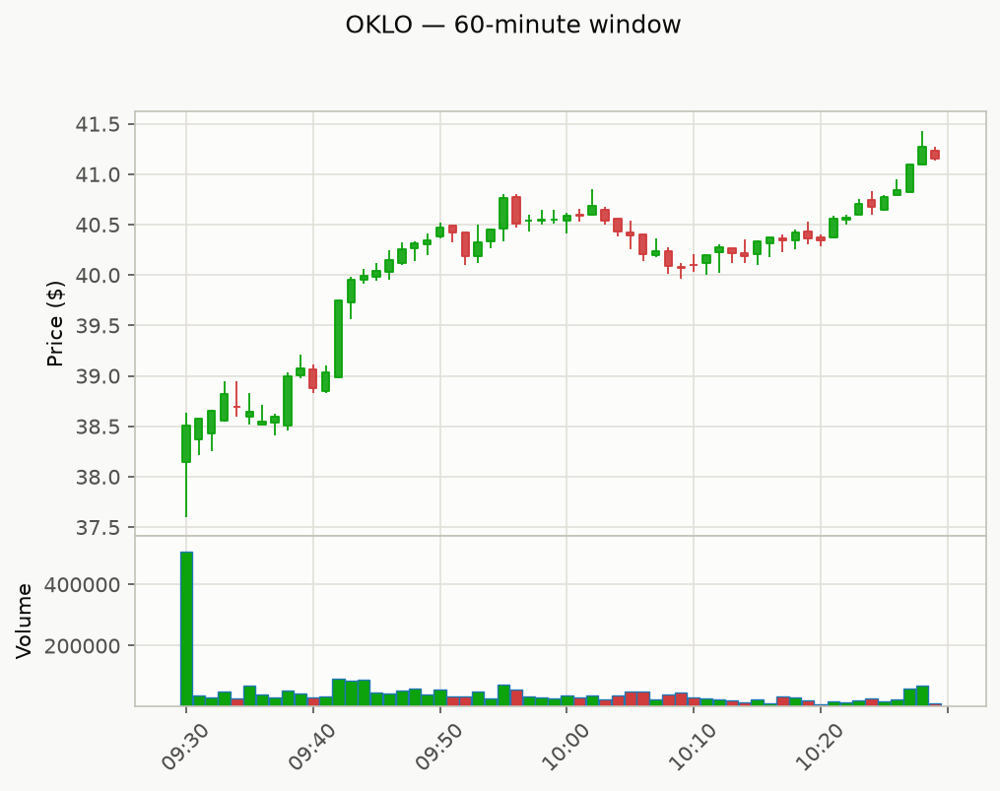
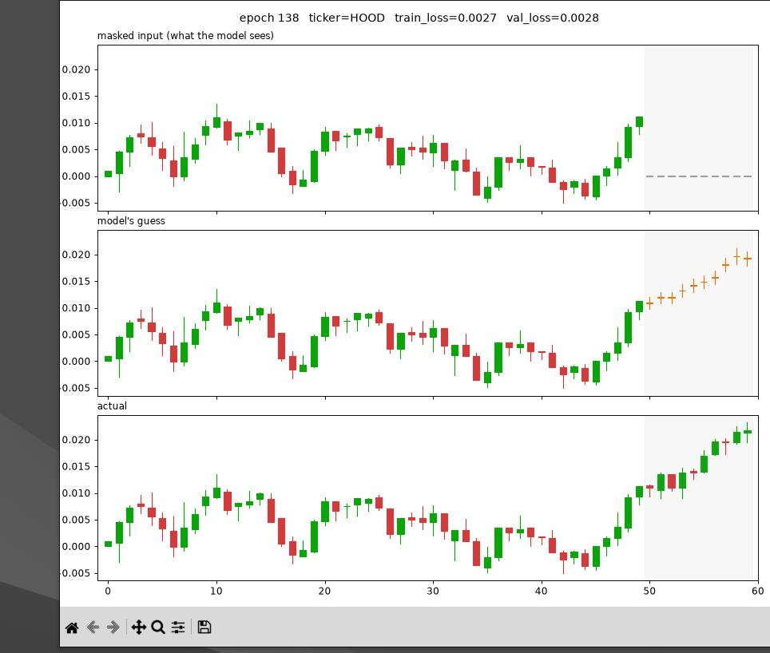
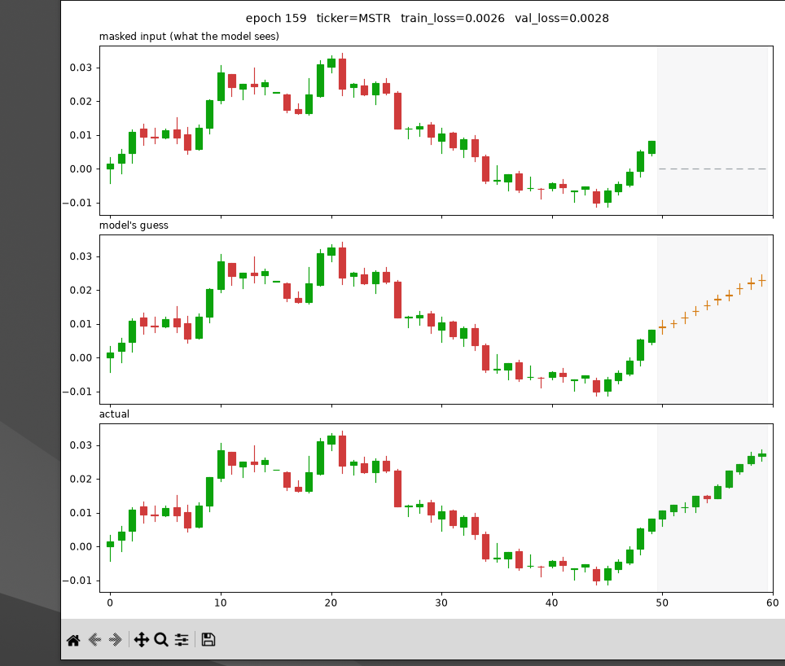

# Stock Dashboard

A lightweight Python project for training and evaluating a transformer-based denoiser on intraday stock candle data.

## Overview

This repository downloads 1-minute OHLCV data from Yahoo Finance, converts each trading day into normalized sliding windows, and trains a masked-window transformer to reconstruct masked trailing timesteps. The model learns to forecast short-term price dynamics by progressively unmasking the unknown horizon in a self-supervised way.

## What this project includes

- Data ingestion from Yahoo Finance using `yfinance`.
- Per-day window extraction that prevents windows from crossing overnight gaps.
- Normalization that converts price channels to relative returns and volume to standardized log-volume.
- A mask-conditioned transformer denoiser that reconstructs only masked positions.
- A training loop with chronological hold-out validation for future-relative evaluation.
- A sampling/evaluation script that forecasts the last few minutes of a window via progressive unmasking.
- A debug utility that prints a sample window and saves a candle chart.

## Main scripts

- `config.py`
  - Centralized configuration for tickers, download settings, model hyperparameters, training parameters, and sampling settings.
- `get_stock_info.py`
  - Downloads intraday candle history for a given ticker and groups the data by trading day.
- `windows.py`
  - Converts raw daily candle data into fixed-length sliding windows and normalizes each window.
- `dataset.py`
  - Creates a masked-window dataset where the trailing suffix of each window is hidden during training.
- `model.py`
  - Defines the transformer denoiser and the masked reconstruction loss.
- `train.py`
  - Builds the dataset, splits it chronologically, trains the model, and saves the best checkpoint to `denoiser.pt`.
- `sample.py`
  - Loads the trained checkpoint and evaluates the model by forecasting the held-out horizon.
- `debug_window.py`
  - Downloads a sample candle window, prints the raw and normalized data, and saves a debug chart to `debug_candles.png`.

## How it works

1. `get_stock_info.py` downloads intraday candles for each ticker in `config.TICKERS`.
2. `windows.py` extracts windows of length `config.WINDOW_SIZE` from each trading day and normalizes them.
3. `dataset.py` masks a random trailing portion of each window during training. The input keeps the known prefix and replaces masked entries with `0.0`.
4. `model.py` defines a transformer encoder that conditions on the known prefix, the mask, and a scalar timestep embedding.
5. `train.py` trains the model on historical windows and evaluates it on the most recent trading days for each ticker.
6. `sample.py` reconstructs the last `config.FORECAST_HORIZON` timesteps by iteratively revealing predicted values, then reports mean absolute error and directional accuracy.

## Requirements

Install the required dependencies:

```bash
python -m pip install torch numpy pandas yfinance
```

Optional visualization dependencies:

```bash
python -m pip install mplfinance
```

## Configuration

Edit `config.py` to customize:

- `TICKERS` — one or more stock tickers to download and train on.
- `PERIOD` — intraday history lookback window (default `7d`).
- `INTERVAL` — candle resolution (default `1m`).
- `WINDOW_SIZE` — minutes per training window.
- `VAL_DAYS` — number of most recent days held out per ticker for validation.
- `FORECAST_HORIZON` — how many minutes into the future to predict.
- `SAMPLING_STEPS` — number of progressive unmasking steps during forecasting.
- Model architecture values such as `D_MODEL`, `N_HEADS`, and `N_LAYERS`.

## Run the project

Train the model:

```bash
python train.py
```

Run the forecast evaluation:

```bash
python sample.py
```

Run the debug viewer utility:

```bash
python debug_window.py
```

If you want to inspect the dataset shape without training, run:

```bash
python windows.py
```

## Example output

If you run `python debug_window.py`, the repository saves a debug candlestick chart to `debug_candles.png` and prints the raw vs normalized window data.



This chart is a convenient visual example of the data the model uses for forecasting.

### Live training preview

Running `visualize_training.py` alongside `train.py` opens a live three-panel view of one validation window per epoch: what the model's input actually looks like (the trailing horizon blanked out), what it guesses for that horizon, and the real values for comparison.




## Output files

- `denoiser.pt` — saved model checkpoint for the best validation loss.
- `debug_candles.png` — sample chart generated by `debug_window.py`.
- `training_preview_*.png` — example screenshots of `visualize_training.py`'s live view.

## Notes

- `yfinance` only serves recent 1-minute intraday history, so the available lookback for `interval='1m'` is limited.
- The model is trained on normalized windows, so outputs are relative to each window's starting price scale.
- To add more data, include additional tickers in `config.TICKERS` and retrain.
- `debug_window.py` is the closest built-in viewer utility in this project; it prints a sample window and saves a plot rather than launching an interactive GUI.
